# 📦 StoryTracks

StoryTracks is a **geo-based social blogging platform** where users can record and explore experiences through interactive maps.
Users can upload photos, extract location/time metadata, generate AI-assisted summaries, and publish posts — all in one flow.
The main feed visualizes posts across the world on Google Maps, allowing intuitive geographic exploration.
 

✨ **Try it now → https://story-tracks.vercel.app/**

---

## 🚀 Tech Stack

| Category   | Technologies |
|------------|--------------|
| **Frontend** | Next.js (App Router), React, Google Maps API |
| **Backend**  | Spring Boot, Spring Security (JWT), JPA / QueryDSL, PostgreSQL, Redis Cache, AWS S3, Gemini API |
| **DevOps**   | AWS EC2 (production), Docker Compose, GitHub Actions (automated backend deployment), Vercel (frontend hosting) |


---


## 🧱 Repository Structure
| Repo | Description | 
|------|-------------| 
| **[StoryTracks-fe](https://github.com/julsweonCodes/StoryTracks-fe)** | Next.js frontend application responsible for UI, routing, Google Maps visualization, AI-assisted post creation, and user interaction flows | 
| **[StoryTracks-be](https://github.com/julsweonCodes/StoryTracks-be-new)** | Spring Boot backend service providing authentication (JWT), post management, geo-clustering logic, Redis caching, image upload to S3, and all core RESTful APIs |

---

## ✨ Key Features

### 🗺️ Geo-Based Post Exploration (Main Feed)
- Browse clustered posts on an interactive Google Map API
<div>
  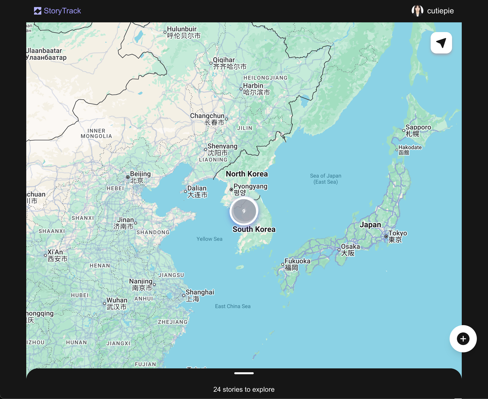
  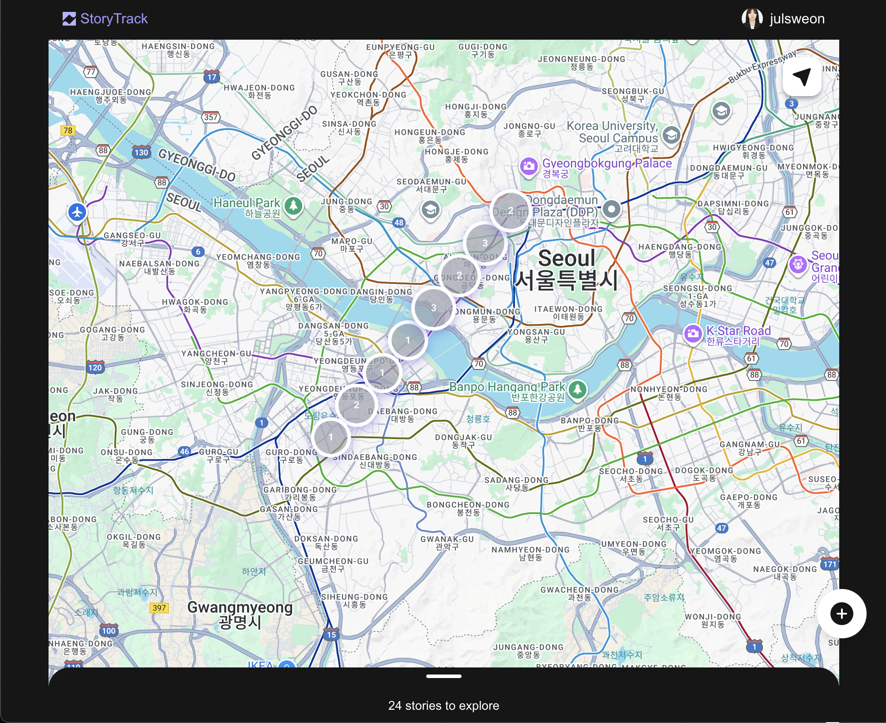
</div>
<br>
 
- Tap a regional marker on the map to view posts in that area
<div>
  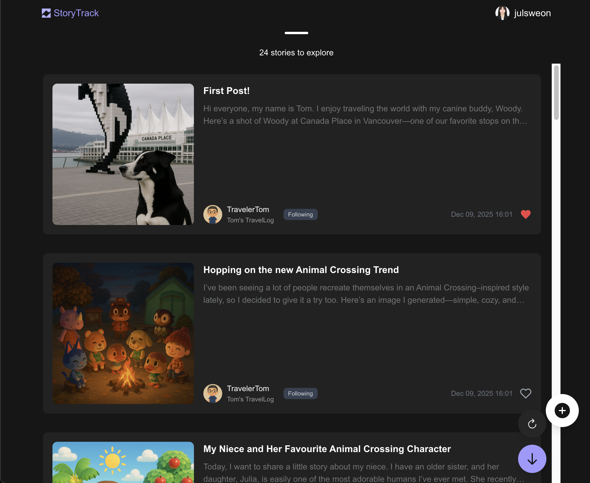
  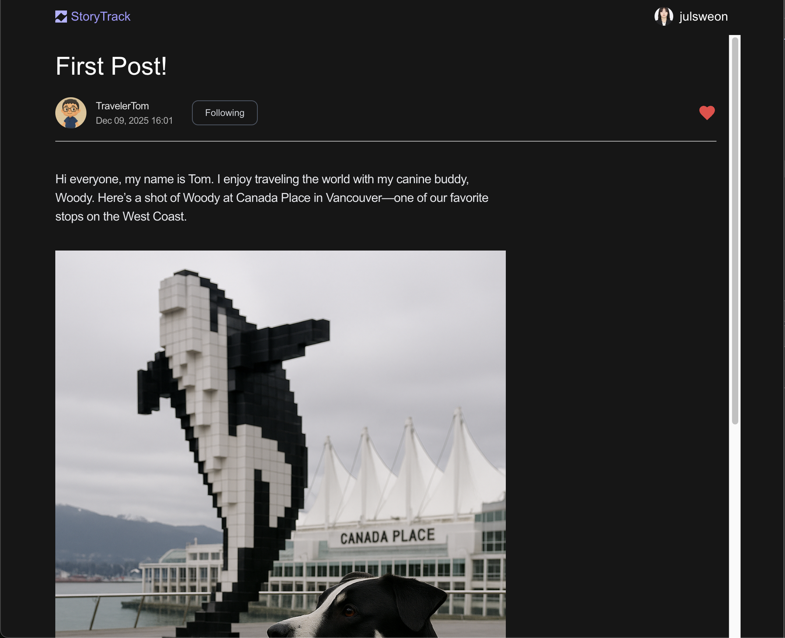
</div>


### 🔮 AI-Assisted Post Creation
- Extracts metadata (latitude/longitude, timestamp) from images
- Generates summaries using Gemini based on user-selected writing styles
<div>
  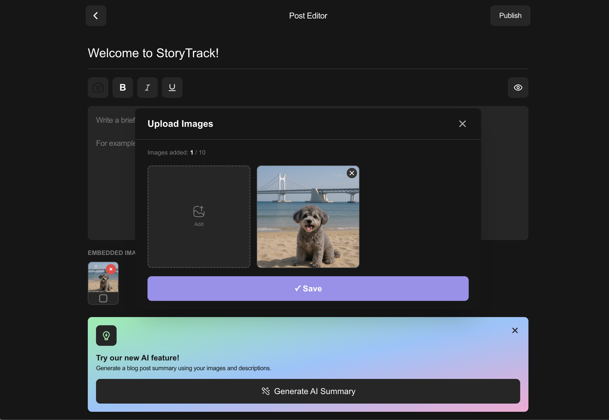
  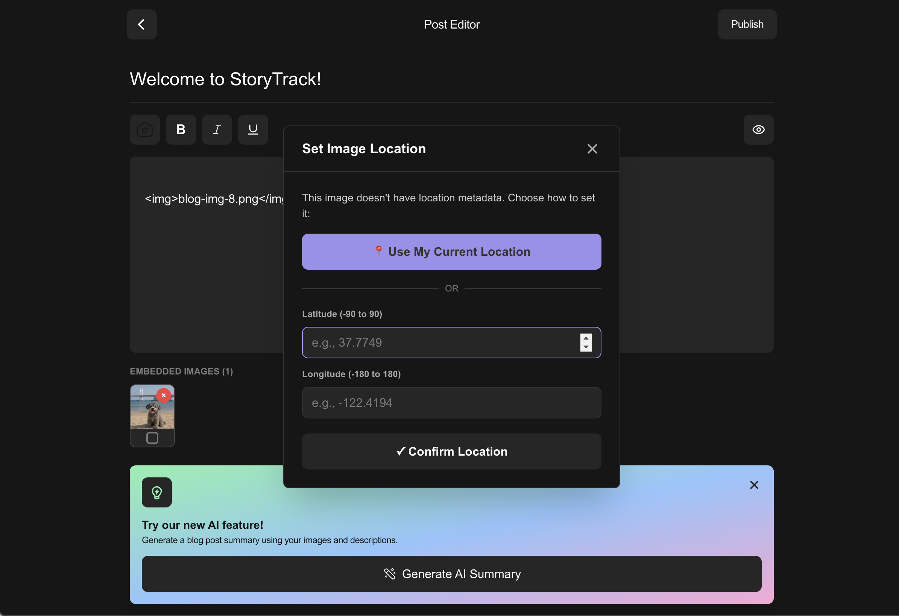
  </div>
<div>
  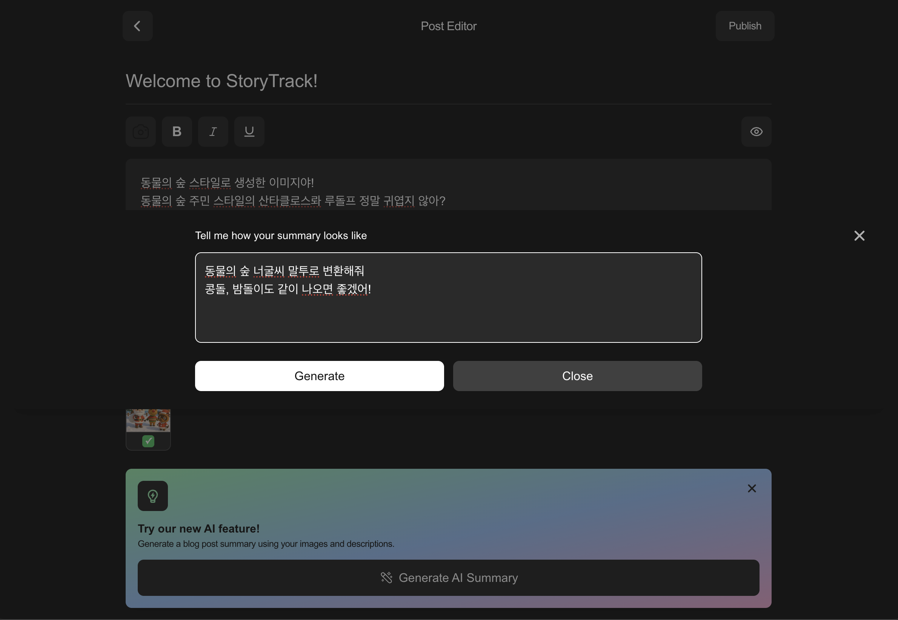
  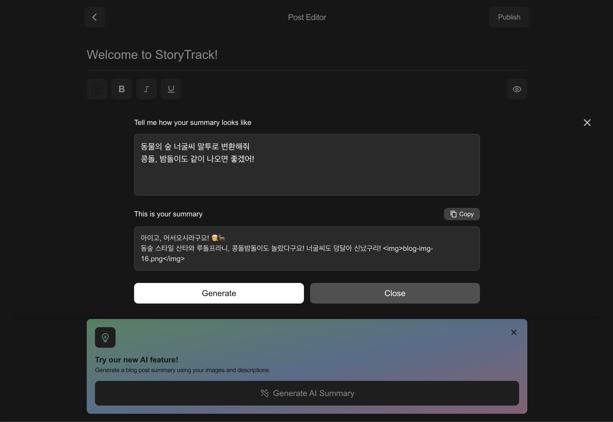
</div>

<div>
  
  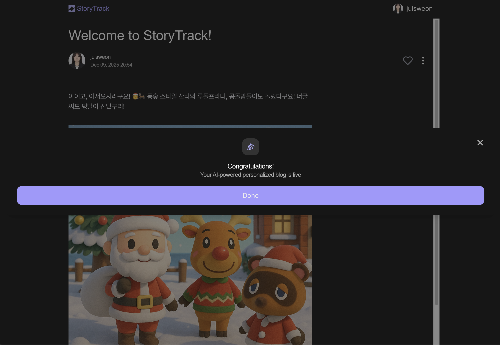
</div>
<br>


### 👤 User Blogs
- Browse other users' blogs and view location-clustered posts
<div>
  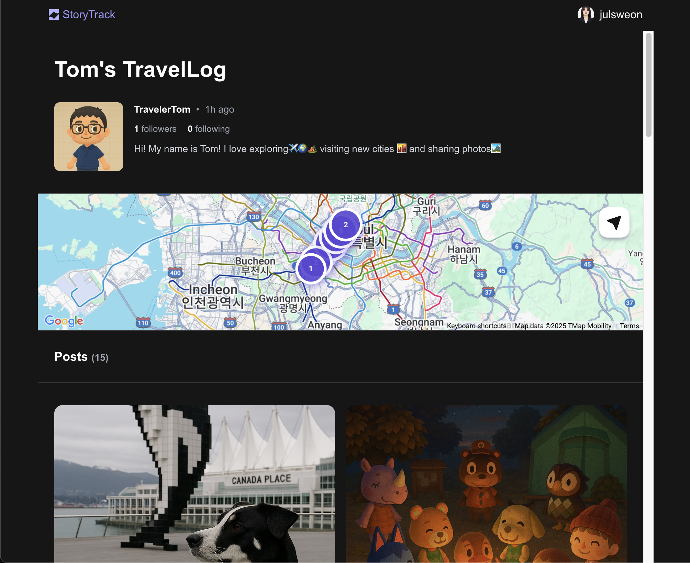
  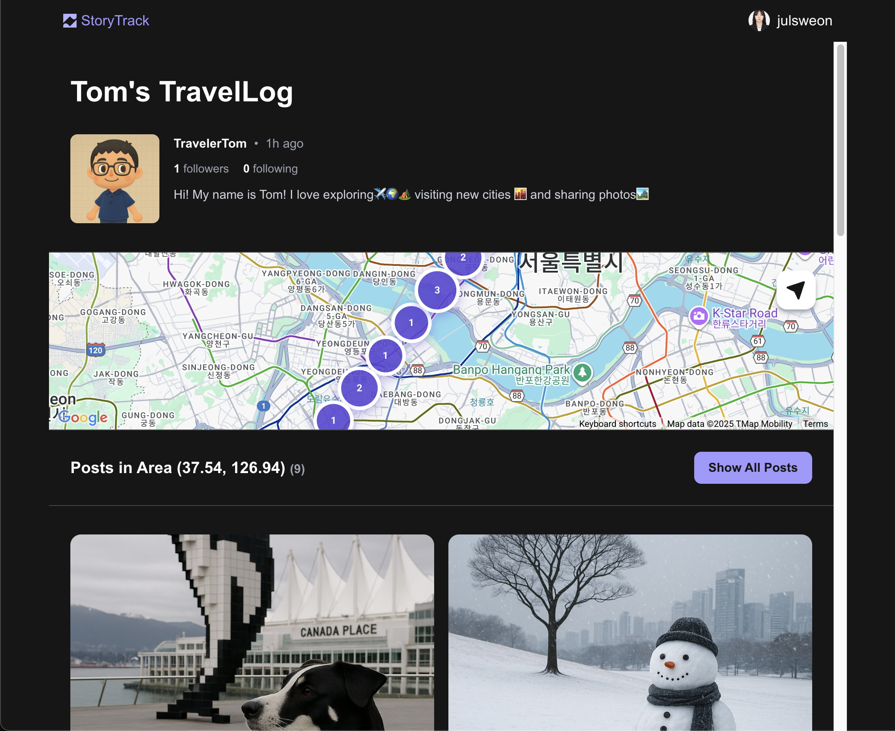
</div>
<br>
- Manage personal profile and blog information
<div>
  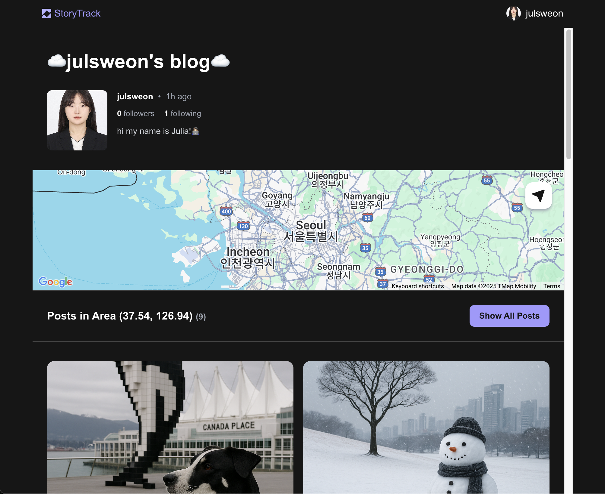
  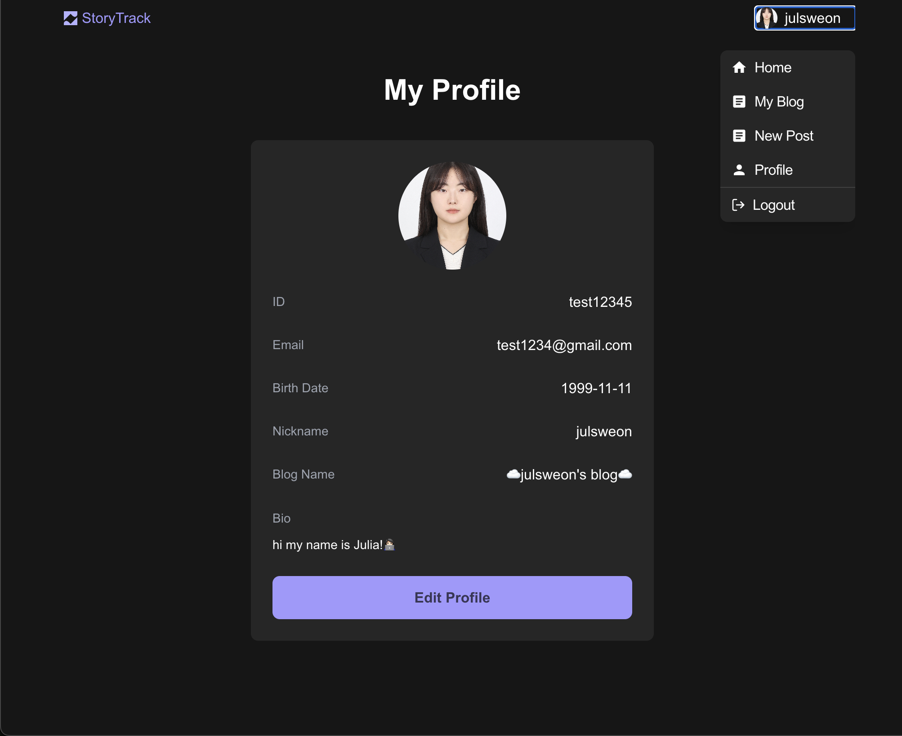
</div>


---

## 🧩 Architecture Overview

```
            ┌───────────────────────┐
            │     Frontend          │
            │       (Next.js)       │
            └────────────┬──────────┘
                         │
                         ▼
            ┌────────────────────────┐
            │     Backend API        │
            │      (Spring Boot)     │
            └────────────┬───────────┘
                         │
        ┌────────────────┴────────────────┐
        │                                 │
        ▼                                 ▼
┌──────────────────┐            ┌─────────────────┐
│   Database       │            │      Cache      │
│   PostgreSQL     │            │      Redis      │
└──────────┬───────┘            └─────────┬───────┘
           │                              │
           ▼                              │
┌─────────────────────────┐               │
│        AWS S3           │               │
│     (Image Storage)     │               │
└──────────┬──────────────┘               │
           │                              │
           ▼                              ▼
   ┌────────────────────────────────────────────┐
   │      External APIs (Google Maps, Gemini)   │
   └────────────────────────────────────────────┘
```


---

## 🔧 Backend — Key Implementations

| Feature Area                         | Details                                                                                          |
| ------------------------------------ | ------------------------------------------------------------------------------------------------ |
| **Geo-clustering & regional feed**   | Multi-precision (1–3) spatial clustering using image metadata + Redis caching for fast & high-availability feed |
| **JWT authentication/authorization** | User verification, secure access for posts, likes, and blog features                             |
| **Redis Caching**                    | Caches user image clusters and regional feeds to reduce DB load and improve latency              |
| **AWS S3 Integration**               | Multipart image upload and storage management                                                    |
| **Docker & CI/CD**                   | Dockerfile + docker-compose.prod.yml, **GitHub Actions for automated EC2 deployment**            |


---

## 📌 Upcoming Enhancements
- Comments
- Follow-based personalized feed
- Mobile UI improvements
- Social sharing

